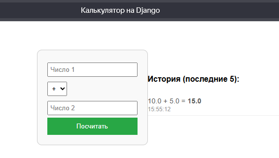

# **🧮 Калькулятор на Django**
## Лабораторная работа №11

---

## 🎯 **Цель работы**

Научиться разрабатывать веб-приложения на Django и контейнеризировать их в Docker.

---

## 🗄️ **Модель данных (models.py)**

```python
from django.db import models

class CalculationHistory(models.Model):
    num1 = models.FloatField()
    num2 = models.FloatField()
    result = models.FloatField()
```   
---

## 🖥️ **Представление (views.py)**

```python
from django.shortcuts import render
from .models import CalculationHistory
def index(request):
    result = None
    error = None
    if request.method == 'POST':
        try:
            num1 = float(request.POST.get('num1'))
            num2 = float(request.POST.get('num2'))
            operation = request.POST.get('operation')
            
            if operation == '+':
                result = num1 + num2
            elif operation == '-':
                result = num1 - num2
            elif operation == '*':
                result = num1 * num2
            elif operation == '/':
                if num2 == 0:
                    error = "Деление на ноль!"
                else:
                    result = num1 / num2
            
            if error is None:
                CalculationHistory.objects.create(
                    num1=num1, num2=num2, 
                    operation=operation, result=result
                )
        except ValueError:
            error = "Ошибка ввода!"
    history = CalculationHistory.objects.all().order_by('-created_at')[:5]
    return render(request, 'calculator/index.html', {
        'result': result,
        'error': error,
        'history': history,
    })
```
---

## 🧭 **Маршруты (urls.py)**

**config/urls.py**
```python
from django.urls import path, include
urlpatterns = [
    path('', include('calculator.urls')),
]
```

**calculator/urls.py**
```python
from django.urls import path
from . import views
urlpatterns = [
    path('', views.index, name='index'),
]
```
---

## 🐳 **Dockerfile**
FROM python:3.13-slim
WORKDIR /ap
COPY requirements.txt ./
RUN pip install --no-cache-dir -r requirements.txt
COPY . .
EXPOSE 8000
CMD ["sh", "-c", "python manage.py migrate && python manage.py runserver 0.0.0.0:8000"]

---

## 🖼️ **Результат работы**



---

## ✅ **Выводы**

- Разработано веб-приложение на Django
- Реализован калькулятор с историей вычислений
- Приложение упаковано в Docker
- Лабораторная работа выполнена